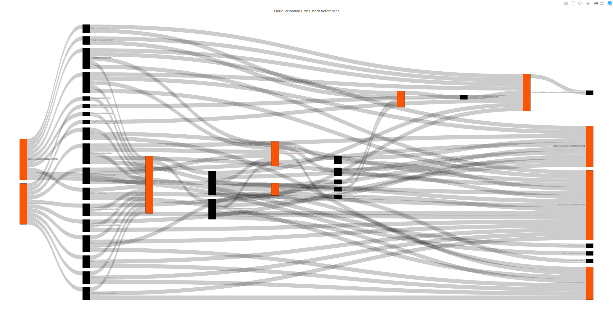

# AWS CloudFormation Cross-stack References
> Visualize stack outputs / imports in a Sankey diagram to identify optimizations and circular dependencies.



Fast, simple CLI which will inspect your [AWS CloudFormation stacks](https://docs.aws.amazon.com/AWSCloudFormation/latest/UserGuide/stacks.html) and paint a Sankey diagram. This is useful for showing how stacks are connected in a multi-stack deployment. It is also useful for identifying circular dependencies which can arise when gradually patching stacks.

## Install
```
npm install -g cf-xviz
```

## Usage
```
Usage: cf-xviz [options]

Visualize cross-stack references in your AWS CloudFormation stacks.

Options:
  -V, --version           output the version number
  -p, --profile <string>  use a specific profile from your credential file. (default: "default")
  -r, --region <string>   the region to use. (default: "us-east-1")
  -b, --browser <string>  the browser to use. (default: "firefox")
  -h, --help              output usage information
```

**-p, --profile <string>** Choose which profile to use from your [AWS credentials file](https://docs.aws.amazon.com/cli/latest/userguide/cli-configure-files.html). Usually found in `~/.aws/credentials`.

**-r, --region <string>** Choose which region your stacks are deployed in. E.g. `eu-west-1`.

**-b, --browser <string>** Choose which browser to open the visualization in. E.g. `google-chrome`.
